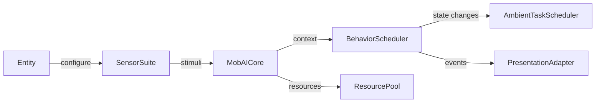
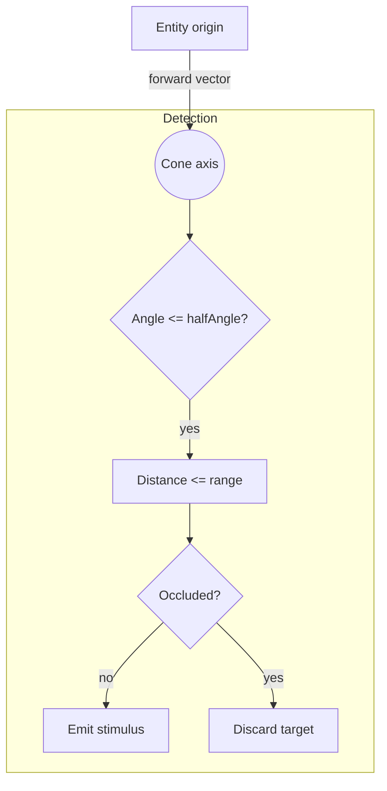

# Mob AI Core Guide

The crowned ghost runner uses a modular AI core that layers personas, traits, sensors, and behavior schedulers on top of the shared entity framework. This guide documents the modules that participate in that stack, the configuration schema each layer consumes, and the workflows for extending the system.

## Architecture layers

The runtime separates responsibilities into discrete layers so you can swap or augment pieces without rewriting the entire AI loop:

1. **Resource & trait bootstrap** – `MobAICore` collects trait definitions (`three-demo/src/entities/ai/traits/`) and instantiates a `ResourcePool` for the persona's stamina, energy, and custom meters.
2. **Perception** – `SensorSuite` aggregates individual `MobSensor` subclasses (vision cones, proximity rings, thresholds) and rebroadcasts stimuli on the AI event bus.
3. **Context synthesis** – Persona definitions merge their sensor presets, resource defaults, and metadata into the AI context so downstream behaviors share a consistent snapshot.
4. **Behavior scheduling** – The `BehaviorScheduler` orders behavior-tree loops created by the `BehaviorRegistry`, while the `AmbientTaskScheduler` queues low-priority tasks like patrol refreshes or coordination signals.
5. **Presentation bridge** – Entities such as `CrownedGhostRunnerEntity` attach `AIPresentationAdapter` instances that translate scheduler state changes into animation intents.



## Module map

| Concern | Module | Notes |
| --- | --- | --- |
| AI root | `three-demo/src/entities/ai/mob-ai-core.js` | Coordinates personas, behaviors, events, and resource state. |
| Traits | `three-demo/src/entities/ai/traits/` | Trait definitions invoked when personas are activated. |
| Personas | `three-demo/src/entities/ai/personas/` | Bundles traits, sensors, resources, behavior layers, and metadata. |
| Sensors | `three-demo/src/entities/ai/sensors/` | Base `MobSensor` plus cone, ring, and threshold specializations. |
| Resources | `three-demo/src/entities/ai/resources/resource-pool.js` | Emits change events as pools regen, deplete, or refill. |
| Ambient tasks | `three-demo/src/entities/ai/environment/ambient-task-scheduler.js` | Handles staggered background jobs (e.g., scouting pings). |
| Presentation | `three-demo/src/entities/ai/presentation/` | Maps behavior events to animation cues. |
| Tests | `three-demo/src/entities/ai/__tests__/` | Integration and contract coverage for the full stack. |

## Persona configuration schema

Persona descriptors provide the glue between raw configuration data and runtime modules. The schema below matches `spectral-runner`:

| Field | Type | Description |
| --- | --- | --- |
| `name` | `string` | Unique identifier used when calling `usePersona`. |
| `traits` | `Array<string | TraitRef>` | Each entry references a trait definition. Object entries accept `options`. |
| `sensors` | `object` | Merged into the AI context (`presets`, `visionRange`, `hearingRange`, etc.). |
| `resources` | `Record<string, ResourceConfig>` | Seed values for the `ResourcePool` (supports `max`, `initial/current`, `regen`, `metadata`). |
| `behaviors` | `Array<BehaviorDescriptor>` | Behavior loop descriptors consumed by the `BehaviorRegistry`. |
| `metadata` | `object` | Arbitrary values; ghost runner uses this for movement tuning and presentation defaults. |

`BehaviorDescriptor` entries mirror the tests in `mob-ai-core.transition-flow.test.js`:

```ts
interface BehaviorDescriptor {
  name?: string;        // Defaults to the loop name
  loop: string;         // Name registered with BehaviorRegistry
  priority?: number;    // Higher values run earlier each tick
  duration?: { min: number; max: number; unit: 'seconds' | 'ticks' };
  triggers?: Array<{ type: 'time' | 'percept' | string; [key: string]: unknown }>;
  options?: Record<string, unknown>; // Forwarded to the loop factory
  metadata?: Record<string, unknown>; // Stored on the behavior layer
}
```

## Example personas and behaviors

The ghost runner persona ships with high-agility defaults, but you can author variants by registering a new descriptor or by overriding fields when calling `usePersona`:

```js
import { MobAICore } from '../entities/ai/mob-ai-core.js';

const ai = new MobAICore();
ai.registerPersona('mist-sprinter', {
  inherits: 'spectral-runner',
  traits: [
    { name: 'nocturnal', options: { lightThreshold: 0.6 } },
    { name: 'packHunter', options: { minAllies: 2, formation: 'flank' } },
  ],
  sensors: { visionRange: 55, presets: ['spectral-vision', 'echo-location'] },
  resources: {
    stamina: { max: 150, regen: 8 },
    ectoplasm: { max: 60, regen: 6 },
  },
  behaviors: [
    { name: 'mist-scout', loop: 'idle', priority: 3, options: { wanderChance: 0.6 } },
    { name: 'mist-chase', loop: 'chase', priority: 9, triggers: [{ type: 'percept', key: 'targetVisible', equals: true }] },
  ],
});

const persona = ai.usePersona('mist-sprinter', {
  sensors: { hearingRange: 140 },
  metadata: { movement: { walkSpeed: 1.15, turnInPlaceDuration: 0.9 } },
});
```

When the persona is installed the AI core automatically merges the sensor ranges, rehydrates resource pools, and installs the `BehaviorScheduler` layers.

To attach a behavior loop without replacing the persona defaults:

```js
const patrolLoop = ai.useBehaviorLoop('idle', {
  priority: 2,
  wanderChance: 0.35,
  idleChance: 0.15,
});
```

## Perception cone reference

The vision sensor performs a geometric test between the entity's forward vector and each candidate target. The diagram below illustrates the sample workflow.



## Task scheduling timeline

Ambient tasks and behavior loops share the same update cadence but run in priority order. Use this timeline when balancing new loops:

```mermaid
gantt
  title Ghost Runner Scheduling
  dateFormat  X
  axisFormat  %L
  section Tick 0
  Ambient cooldown     :done, 0, 1
  Vision sampling      :active, 0, 1
  Behavior (idle loop) :done, 0, 1
  section Tick 1
  Ambient cooldown     :active, 1, 1
  Task handoff         :done, 1, 1
  Behavior (wander)    :active, 1, 1
  section Tick 2
  Ambient broadcast    :done, 2, 1
  Task resolution      :done, 2, 1
  Behavior (chase)     :active, 2, 1
```



## Extension workflows

### Add a new sensor
1. Subclass `MobSensor` in `three-demo/src/entities/ai/sensors/` and implement `sampleWorld(context)`.
2. Register the sensor in a suite (e.g., from the entity's `onSpawn` hook) and optionally add a preset string so personas can pull it in automatically.
3. Emit structured stimuli (`{ intensity, target, position, ... }`) so downstream behaviors can reason about the payload.

### Add a new trait
1. Create a trait definition in `three-demo/src/entities/ai/traits/` that exports `{ name, apply(core, options) }`.
2. Register it via `MobAICore.registerTrait(name, trait)` or include it in `defaultTraits`.
3. Reference the trait from persona descriptors or call `core._activateTrait` manually during bootstrap (tests cover this private helper).

### Add a new behavior loop
1. Extend `BehaviorRegistry` with `registerLoop(name, factory)` or reuse the helper loops already exported.
2. Reference the loop from a persona `behaviors` entry or call `aiCore.useBehaviorLoop(name, options)` at runtime.
3. Provide metadata for the presentation adapter if the loop maps to a new animation state.

## Ghost runner quick start

1. Ensure entities are registered (Vite bootstrapping already calls `registerBuiltinEntities()` inside `three-demo/src/entities/index.js`).
2. Acquire the entity manager (for example from `initializeWorld` or the developer console) and spawn the runner:
   ```js
   import { registerBuiltinEntities, createEntityManager } from './entities/index.js';

   registerBuiltinEntities();
   const manager = await createEntityManager({ /* world references */ });
   const ghost = manager.spawnEntity('crowned_ghost_2', {
     position: { x: 12, y: 18, z: -6 },
     behavior: { walkSpeed: 1.1, walkDurationRange: [2, 5] },
   });
   ```
3. The `CrownedGhostRunnerEntity` constructor creates a `MobAICore`, applies the `spectral-runner` persona, and hooks the presentation adapter automatically. Overriding the `behavior` key lets you tweak movement defaults without editing the persona.
4. Call `ghost.aiCore.update(deltaSeconds, { world: worldContext })` within your entity tick to keep the scheduler active. The entity class already does this during its update loop, so manual calls are only needed in bespoke simulations.

## Additional references

- Review `three-demo/src/entities/ai/__tests__/spectral-runner.integration.test.js` for an end-to-end example that exercises sensor fusion and resource spending.
- `three-demo/src/entities/crowned-ghost-runner.js` demonstrates how to bridge AI output with movement controllers and animation playback.
